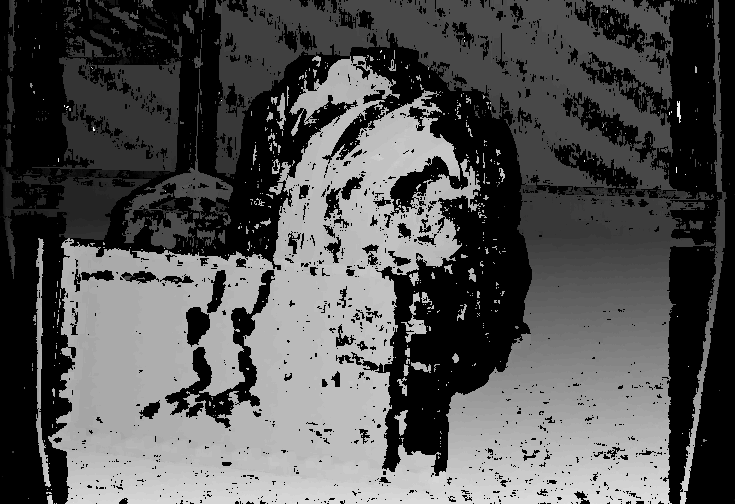

# Creating Stereo Image from two images using ZNCC algorithm

Implement ZNCC algorithm using
- plain c++
- c++ with OpenCL
- c++ with Nvidia CUDA
- c++ with OpemMP

Left Image

Right Image

Combine them using ZNCC algorithm to get

